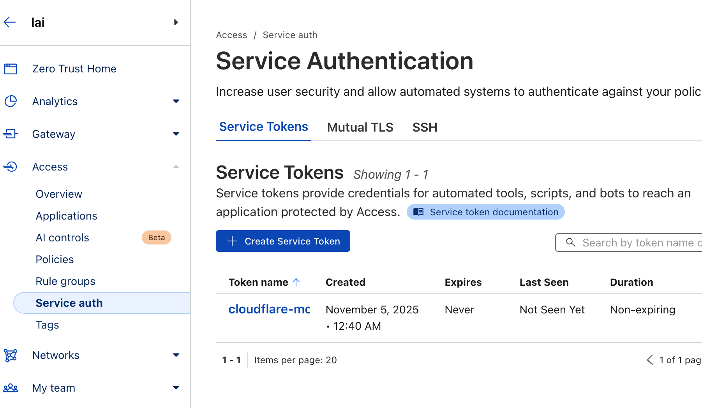
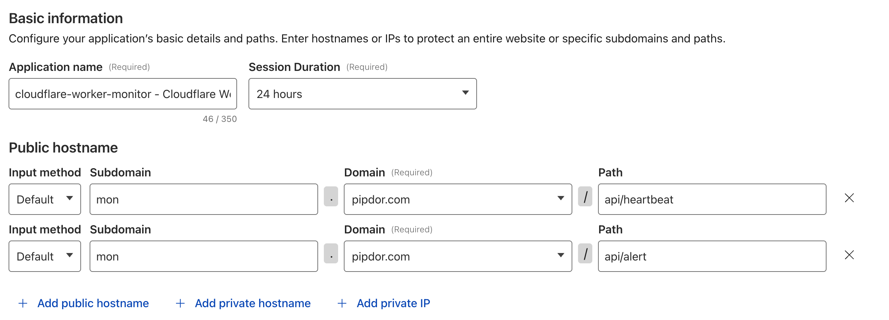
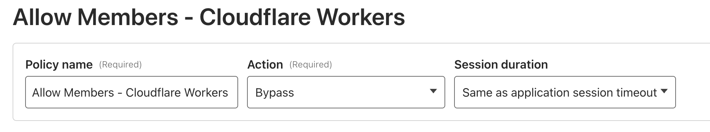
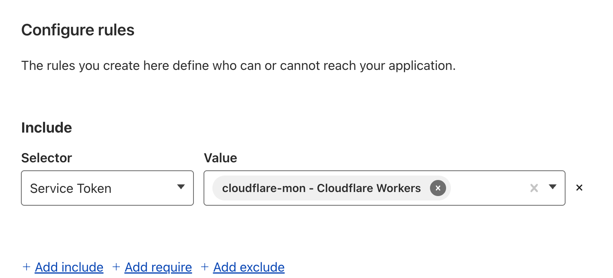

# Security Guide

## 🔒 API Key Management

API keys should **never** be stored in your repository. This project uses **one Cloudflare Worker secret** (`API_KEYS`) containing all API keys in JSON format.

## Setting Up API Keys

### Format

All API keys are stored in a **single secret** called `API_KEYS` as a JSON string:

```json
{
  "service-1": "your-secret-key-1",
  "service-2": "your-secret-key-2",
  "my-api": "your-secret-key-3"
}
```

**Key Points:**
- Use your exact service ID from `services.json` as the key
- Each service can have its own unique API key
- One secret to manage instead of multiple secrets per service

### Option 1: Using GitHub Secrets (Recommended for CI/CD)

1. **Generate API keys for each service:**
   ```bash
   # Generate a strong API key for each service
   openssl rand -base64 32
   ```

2. **Create the JSON object:**
   ```json
   {
     "service-1": "key-generated-in-step-1",
     "service-2": "another-key-generated",
     "my-api": "third-key-generated"
   }
   ```

3. **Add to GitHub Secrets:**
   - Go to your repository → Settings → Secrets and variables → Actions
   - Click "New repository secret"
   - Name: `API_KEYS`
   - Value: Paste your JSON object (one line or formatted)

4. **Update GitHub Actions workflow** (if using):

```yaml
# .github/workflows/deploy.yml
name: Deploy to Cloudflare Workers

on:
  push:
    branches: [main]

jobs:
  deploy:
    runs-on: ubuntu-latest
    steps:
      - uses: actions/checkout@v3
      
      - name: Deploy to Cloudflare Workers
        uses: cloudflare/wrangler-action@v3
        with:
          apiToken: ${{ secrets.CLOUDFLARE_API_TOKEN }}
        env:
          API_KEYS: ${{ secrets.API_KEYS }}
```

### Option 2: Using Wrangler CLI (Local/Manual)

1. **Create your API keys JSON:**
   ```bash
   # Generate keys for each service
   openssl rand -base64 32  # For service-1
   openssl rand -base64 32  # For service-2
   ```

2. **Set the secret using Wrangler:**
   ```bash
   npx wrangler secret put API_KEYS
   ```

3. **When prompted, paste your JSON** (one line or multi-line):
   ```json
   {"service-1":"your-key-1","service-2":"your-key-2"}
   ```
   
   Or formatted:
   ```json
   {
     "service-1": "your-key-1",
     "service-2": "your-key-2"
   }
   ```

The secret will be encrypted and stored securely in Cloudflare.

### Option 3: Using Cloudflare Dashboard

1. **Go to Cloudflare Dashboard** → Workers & Pages
2. **Select your worker**
3. **Go to Settings** → Variables
4. **Click "Add variable"**:
   - Type: **Secret** (not plain text)
   - Variable name: `API_KEYS`
   - Value: Your JSON object
     ```json
     {"service-1":"your-key-1","service-2":"your-key-2"}
     ```
5. **Click "Save"**

## Verifying API Key Configuration

### Check if API key is required

If you set an API key for a service, it will be **required** for all heartbeat requests from that service.

### Test with curl

**Without API key (will fail if key is configured):**
```bash
curl -X POST https://your-worker.workers.dev/api/heartbeat \
  -H "Content-Type: application/json" \
  -d '{"serviceId": "service-1"}'
```

**With API key:**
```bash
curl -X POST https://your-worker.workers.dev/api/heartbeat \
  -H "Content-Type: application/json" \
  -H "Authorization: Bearer your-secret-api-key" \
  -d '{"serviceId": "service-1"}'
```

## Generating Secure API Keys

Generate strong random API keys:

```bash
# On Linux/Mac
openssl rand -base64 32

# Or using Node.js
node -e "console.log(require('crypto').randomBytes(32).toString('base64'))"

# Or online (use a reputable generator)
# https://generate-random.org/api-key-generator
```

## Best Practices

### ✅ DO:
- Use different API keys for each service
- Store API keys in GitHub Secrets or Cloudflare Secrets
- Rotate API keys periodically (every 90 days recommended)
- Use strong, randomly generated keys (minimum 32 characters)
- Keep `services.json` in your repository (it only contains non-sensitive config)

### ❌ DON'T:
- Never commit API keys to your repository
- Never share API keys in chat, email, or documentation
- Never use weak or predictable API keys
- Never reuse the same API key across multiple services
- Never log API keys in your code

## Optional: Disable API Key Authentication

If you want to run without API key authentication (not recommended for production):

Simply don't set any `{SERVICE_ID}_API_KEY` environment variables. The worker will accept heartbeats without authentication.

**Note:** This is only recommended for:
- Local testing
- Internal networks with other security measures
- Non-critical monitoring systems

## Security Checklist

- [ ] Removed API keys from `services.json` ✅ (safe to commit)
- [ ] Generated strong random API keys for each service
- [ ] Created API_KEYS JSON with all service keys
- [ ] Added API_KEYS to GitHub Secrets or Cloudflare Secrets
- [ ] Updated deployment workflow to use API_KEYS secret
- [ ] Tested heartbeat with API key authentication
- [ ] Updated heartbeat clients with correct API keys
- [ ] Set up API key rotation schedule (optional but recommended)

## Rotating API Keys

To rotate API keys:

1. **Generate new API keys**:
   ```bash
   openssl rand -base64 32  # New key for service-1
   ```

2. **Update the API_KEYS JSON**:
   ```json
   {
     "service-1": "new-key-here",
     "service-2": "existing-key-2"
   }
   ```

3. **Update the secret** in GitHub Secrets/Cloudflare/Wrangler

4. **Deploy the worker** (automatically happens with GitHub Actions)

5. **Update heartbeat clients** with new API keys

6. **Test** the new configuration

### Adding New Services

Simply update the API_KEYS JSON to include the new service:

```json
{
  "service-1": "existing-key-1",
  "service-2": "existing-key-2",
  "new-service": "new-key-generated"
}
```

No need to create new secrets - just update the existing one!

## Security Enhacment With Cloudflare Access

Create Service Token for API Access (Zero Trust > Access > Service Auth > Create Service Token)


Create Application in Cloudflare (Zero Trust > Access > Applications)

Target Endpoint to be protected. I protected api/heartbeat and api/alert personally. Will review if other endpoints required to protect as well.


Set the Policy as bypass


Set the Rules with the token just created



Then you ca

## Questions?

If you have security concerns or questions, please:
1. Check the [documentation](README.md)
2. Review [deployment guide](DEPLOYMENT.md)
3. Open an issue (without sharing any secrets!)

---

**Remember:** Security is a shared responsibility. Keep your API keys safe! 🔒

